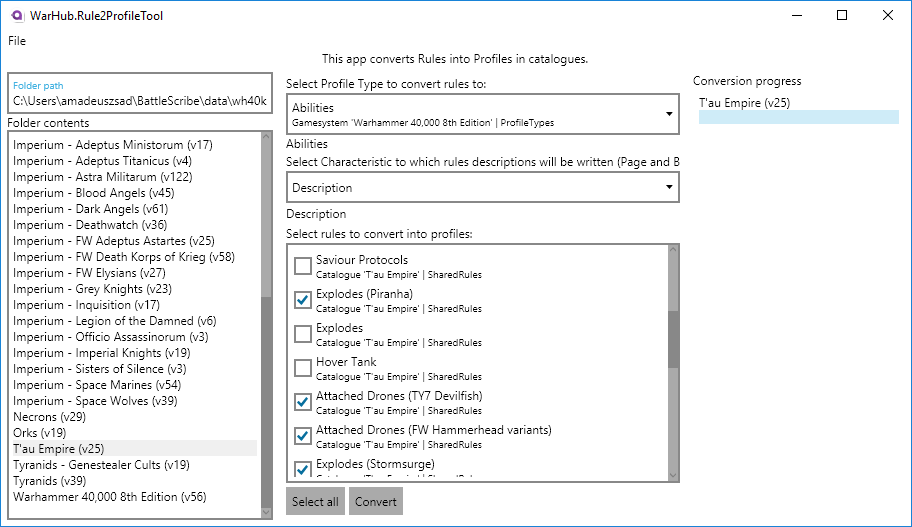

# Rule2ProfileTool

This is a corss-platform tool for BattleScribe catalogues. It allows simple conversion of selected rules into profiles.

1. Start by selecting a directory with your datafiles (`Ctrl + O`):

    

2. Select which ProfileType and Characteristic to use as target, and which rules to convert:

    

3. Click `Convert` and watch the progress!
